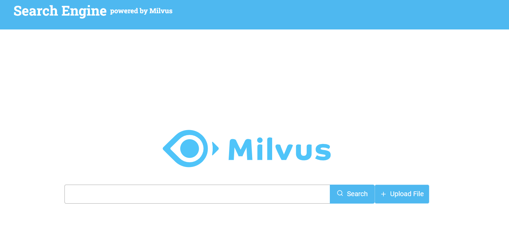

# Dependancies
Before launching the project, we should install followings:
- NodeJS and yarn
- Python 3.7 or higher
- MySQL 5.7 or higher
- Milvus 2.0.0 or higher

# Start Milvus
As the first step, we should launch milvus:
```
sudo docker-compose up -d
```
# Start MySQL
Then, we should launch MySQL:
```
docker run --name mysql-docker -p 3306:3306 -e MYSQL_ROOT_PASSWORD=123456 -d mysql:5.7
```
# Backend Setup
First, we should install server dependancies. To be more neat, create virutalenv before:
```bash
cd server

# install virtualenv
python3 -m venv venv
source ./venv/bin/activate

# install python dependancies
pip install -r requirements.txt
```
## install text-enrich service
Then, we should install a service to loads the backend with each system bootup. 
To this end, move `text-enrich.service` to the place you put the services (usually `/etc/systemd/system/`) and customize it according to your environment and at last install the service:
```bash
mv text-enrich.service /etc/systemd/system/

# install the service
sudo systemctl enable text-enrich --now
```
# Frontend Setup
To this end, we should install dependancies and build the frontend source code with `yarn`:
```bash
cd client

# install dependancies
yarn install

# build source code
yarn build
```
Now, we should put the `build` folder where our webserver (e.g. `Nginx`) can access it.
To this end and if you are working with `Nginx`, move the `example.com.conf` where the `Nginx` configurations located (usually `/etc/nginx/conf.d/`). Then reload nginx to read the added configuratoin:
```bash
mv example.com.conf /etc/nginx/conf.d/

# reload nginx
sudo nginx -s reload
```
Now, you have access to your frontend on the host you consider instead of `example.com`. Check it!


# Load Data
To load your datasets, put your paths in the mapping in the file and run the file:
```
python3 load_data.py
```
After that, it is better to restart the service to be sure the tables are recognized by it:
```
systemctl restart text-enrich
```
# Test
Now, you could search in the webpage and see the results:

